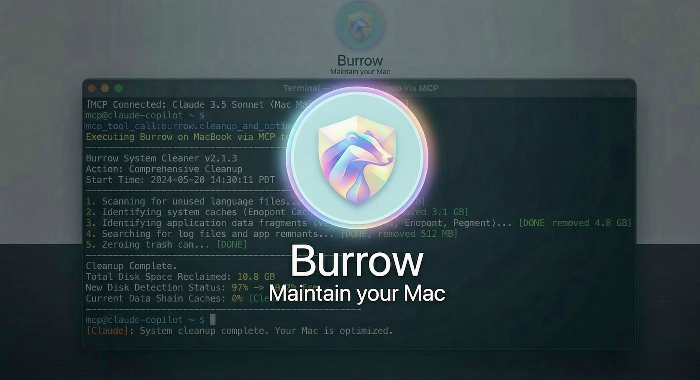

<div align="center">
  
  <h1>Burrow</h1>
  <p><em>Maintain your Mac</em></p>
</div>

<p align="center">
  <a href="https://github.com/jimmy-jain/burrow/stargazers"></a>
  <a href="https://github.com/jimmy-jain/burrow/releases"></a>
  <a href="LICENSE"></a>
  <a href="https://github.com/jimmy-jain/burrow/commits"></a>
</p>

<p align="center">
  
</p>

CleanMyMac + AppCleaner + DaisyDisk + iStat Menus in a single CLI. Deep cleaning, smart uninstall, disk analysis, duplicate finder, live system monitoring, threshold alerts, and an MCP server for AI assistant integration.

## Install

**Homebrew (stable)**

```bash
brew install jimmy-jain/burrow/burrow
```

**Script (stable)**

```bash
curl -fsSL https://raw.githubusercontent.com/jimmy-jain/burrow/main/install.sh | bash
```

**Nightly (latest dev branch)**

```bash
curl -fsSL https://raw.githubusercontent.com/jimmy-jain/burrow/dev/install.sh | BURROW_VERSION=main bash
```

**HEAD (build from source)**

```bash
brew install --HEAD jimmy-jain/burrow/burrow
```

> macOS-only. Requires Bash 3.2+ and Go 1.25+ (for building from source).

## Commands

```bash
bw                              # Interactive menu with arrow/vim key navigation

# Cleanup & Maintenance
bw clean                        # Deep system cleanup (caches, logs, browser data)
bw uninstall                    # Remove apps + launch agents, preferences, remnants
bw optimize                     # Rebuild caches, refresh system services
bw purge                        # Clean project build artifacts (node_modules, target, etc.)
bw installer                    # Find and remove installer files (.dmg, .pkg, .zip)

# Disk & Files
bw analyze                      # Visual disk explorer TUI with Finder trash integration
bw dupes ~/Documents            # Find duplicate files by content hash (xxhash)

# Monitoring & Diagnostics
bw status                       # Live system health dashboard (CPU, GPU, memory, disk, battery)
bw watch                        # Threshold alerts with macOS notifications
bw doctor                       # Developer environment health checks
bw size                         # Developer cache size audit
bw report                       # Machine health snapshot as JSON
bw log                          # Operations log viewer

# Setup & Integration
bw schedule                     # Scheduled maintenance via LaunchAgent
bw hook                         # Shell cd-hook (alerts on large node_modules)
bw touchid                      # Configure Touch ID for sudo
bw completion                   # Shell tab completion (bash/zsh/fish)

# Lifecycle
bw update                       # Update Burrow
bw update --nightly             # Update to latest nightly build (script install only)
bw remove                       # Uninstall Burrow from system
```

Every destructive command supports `--dry-run` to preview before acting. Add `--debug` for verbose output.

## Features

### Deep System Cleanup

```
$ bw clean

Scanning cache directories...

  ✓ User app cache                                           45.2GB
  ✓ Browser cache (Chrome, Safari, Firefox)                  10.5GB
  ✓ Developer tools (Xcode, Node.js, npm)                    23.3GB
  ✓ System logs and temp files                                3.8GB
  ✓ App-specific cache (Spotify, Dropbox, Slack)              8.4GB
  ✓ Trash                                                    12.3GB

====================================================================
Space freed: 95.5GB | Free space now: 223.5GB
====================================================================
```

Creates an APFS snapshot before running (skip with `BW_SKIP_SNAPSHOT=1`). First run forces dry-run with confirmation. Supports whitelisting paths via `bw clean --whitelist` or `~/.config/burrow/whitelist`.

### Smart App Uninstaller

```
$ bw uninstall

Select Apps to Remove
═══════════════════════════
▶ ☑ Photoshop 2024            (4.2G) | Old
  ☐ IntelliJ IDEA             (2.8G) | Recent
  ☐ Premiere Pro              (3.4G) | Recent

Uninstalling: Photoshop 2024

  ✓ Removed application
  ✓ Cleaned 52 related files across 12 locations
    - Application Support, Caches, Preferences
    - Logs, WebKit storage, Cookies
    - Extensions, Plugins, Launch daemons

====================================================================
Space freed: 12.8GB
====================================================================
```

Protected system apps (Safari, Finder, Mail, Messages, etc.) cannot be uninstalled.

### Disk Space Analyzer

Interactive TUI built with [bubbletea](https://github.com/charmbracelet/bubbletea). Navigate directories, open in Finder, delete to Trash.

```
$ bw analyze

Analyze Disk  ~/Documents  |  Total: 156.8GB

 ▶  1. ███████████████████  48.2%  |  📁 Library                     75.4GB  >6mo
    2. ██████████░░░░░░░░░  22.1%  |  📁 Downloads                   34.6GB
    3. ████░░░░░░░░░░░░░░░  14.3%  |  📁 Movies                      22.4GB
    4. ███░░░░░░░░░░░░░░░░  10.8%  |  📁 Documents                   16.9GB
    5. ██░░░░░░░░░░░░░░░░░   5.2%  |  📄 backup_2023.zip              8.2GB

  ↑↓←→ Navigate  |  O Open  |  F Show  |  ⌫ Delete  |  L Large files  |  Q Quit
```

Skips `/Volumes` by default for speed. Use `bw analyze /Volumes` to inspect external drives.

### Duplicate File Finder

Multi-phase pipeline: walk → size filter → inode dedup → partial xxhash (4KB) → full xxhash → sort by reclaimable space.

```
$ bw dupes ~/Documents

3 copies (15.2 MB each, 30.4 MB reclaimable):
  ✓ [1] ~/Documents/report.pdf
    [2] ~/Documents/archive/report.pdf
    [3] ~/Documents/backup/report copy.pdf

━━━ Summary ━━━
  2 duplicate groups, 3 redundant files
  Reclaimable: 38.9 MB
```

Three modes:
- **Report** (default) — scan and show duplicate groups
- **Delete** (`--delete`) — interactive per-group selection, moves to Finder Trash
- **Conserve** (`--conserve <dir>`) — relocate duplicates with manifest for `--restore`

### Live System Monitor

Real-time dashboard with composite health score (0-100), SMART disk health, battery cycle count, and per-process memory.

```
$ bw status

Burrow Status  Health ● 92  MacBook Pro · M4 Pro · 32GB · macOS 14.5

⚙ CPU                                    ▦ Memory
Total   ████████████░░░░░░░  45.2%       Used    ███████████░░░░░░░  58.4%
Load    0.82 / 1.05 / 1.23 (8 cores)     Total   14.2 / 24.0 GB

▤ Disk                                   ⚡ Power
Used    █████████████░░░░░░  67.2%       Level   ██████████████████  100%
Free    156.3 GB                         Health  Normal · 423 cycles

⇅ Network                                ▶ Processes
Down    ▁▁█▂▁▁▁▁▁▁▁▁▇▆▅▂  0.54 MB/s      Code       ▮▮▮▮▯  42.1%
Up      ▄▄▄▃▃▃▄▆▆▇█▁▁▁▁▁  0.02 MB/s      Chrome     ▮▮▮▯▯  28.3%
```

Auto-outputs JSON when piped: `bw status | jq '.health_score'`

### Threshold Alerts

Background monitor with macOS notifications. Configure rules in `~/.config/burrow/watch_rules`:

```
disk_free_gb < 10
cpu_percent > 90
battery_health < 80
disk_used_percent > 95
```

```bash
bw watch              # Start monitoring (15-minute cooldown per rule)
```

Includes predictive disk space projection based on usage history.

### Developer Tools

```bash
bw doctor             # Health checks: Homebrew, Xcode, shell, git, SSH, Python, Node
bw doctor --json      # Machine-readable output

bw size               # Cache sizes: Homebrew, npm, pip, Docker, Xcode, CocoaPods
bw size --json        # Machine-readable output

bw log                # View operations log
bw log --since 7d     # Filter by time
bw log --grep "clean" # Filter by keyword
bw log --tail 20      # Last N entries

bw report             # Full health snapshot combining status + size + doctor
bw report --out r.json
```

### Scheduled Maintenance

Install a LaunchAgent that runs `bw clean --dry-run` weekly and logs results. Always dry-run only — serves as a reminder, never auto-deletes.

```bash
bw schedule install   # Install weekly LaunchAgent
bw schedule remove    # Remove LaunchAgent
bw schedule status    # Check if installed and running
```

### Shell cd-hook

Alerts when you `cd` into a directory with a large `node_modules` (>500MB):

```bash
eval "$(bw hook bash)"    # Add to .bashrc
eval "$(bw hook zsh)"     # Add to .zshrc
bw hook fish | source     # Add to config.fish
```

## MCP Server

Burrow includes an MCP (Model Context Protocol) server that exposes system maintenance tools to AI assistants like Claude.

**Setup with Claude Code:**

```json
{
  "mcpServers": {
    "burrow": {
      "command": "burrow-mcp"
    }
  }
}
```

**Available tools:**

| Tool | Description | Destructive |
|------|-------------|:-----------:|
| `burrow_status` | System health metrics (CPU, memory, disk, battery) | No |
| `burrow_analyze` | Disk usage analysis for a directory | No |
| `burrow_dupes` | Find duplicate files by content hash | No |
| `burrow_doctor` | Developer environment health checks | No |
| `burrow_size` | Developer cache sizes | No |
| `burrow_report` | Full machine health snapshot | No |
| `burrow_clean_preview` | Preview cleanup (dry-run) | No |
| `burrow_clean_execute` | Execute system cleanup (requires `confirmed: true`) | Yes |
| `burrow_dupes_conserve` | Move duplicates to conservation dir (requires `confirmed: true`) | Yes |
| `burrow_dupes_restore` | Restore conserved files | No |

Destructive tools require explicit `confirmed: true` parameter. All output is JSON for structured consumption.

## Machine-Readable Output

Most commands support `--json` for scripting and automation:

```bash
bw status --json          # System metrics
bw analyze --json ~/Docs  # Disk analysis
bw dupes --json ~/Docs    # Duplicate report
bw doctor --json          # Health checks
bw size --json            # Cache sizes
bw report --out file.json # Full health report

bw status | jq '.'        # Auto-JSON when piped
```

## Safety

Burrow performs destructive operations on user systems. Safety is enforced at multiple layers:

- **Protected paths** — `/System`, `/usr`, `/bin`, `/sbin`, `/etc` and other critical directories are blocked
- **Protected apps** — Safari, Finder, Mail, Messages and other system apps cannot be uninstalled
- **Path validation** — symlinks resolved and validated, `..` traversal rejected
- **Whitelist** — user-protected paths in `~/.config/burrow/whitelist`
- **Dry-run** — every destructive command supports `--dry-run` preview
- **APFS snapshots** — created before `bw clean` runs
- **Trash over delete** — `bw analyze` and `bw dupes --delete` use Finder Trash (recoverable)
- **Operation logging** — all deletions logged to `operations.log` (5MB rotation)
- **Risk labels** — dry-run output shows `[LOW]`/`[MEDIUM]`/`[HIGH]` risk ratings
- **First-run guard** — first `bw clean` forces dry-run with confirmation

See [SECURITY.md](SECURITY.md) and [SECURITY_AUDIT.md](SECURITY_AUDIT.md) for details.

## Quick Launchers

Launch Burrow commands from Raycast or Alfred:

```bash
bash scripts/setup-quick-launchers.sh
```

Creates 5 commands: **Burrow Clean**, **Burrow Uninstall**, **Burrow Optimize**, **Burrow Analyze**, **Burrow Status**.

<details>
<summary><strong>Raycast setup</strong></summary>

After running the script:
1. Raycast Settings (Cmd + ,) → **Extensions** → **Script Commands**
2. Click **"+"** → **Add Script Directory**
3. Press **Cmd + Shift + G** and paste: `/Users/YOUR_USERNAME/Library/Application Support/Raycast/script-commands`
4. Search "Reload Script Directories" in Raycast and run it
5. Search for "Burrow Clean", "Burrow Status", etc.

</details>

## Configuration

| Path | Purpose |
|------|---------|
| `~/.config/burrow/whitelist` | Protected cache paths (one per line) |
| `~/.config/burrow/purge_paths` | Custom project scan directories |
| `~/.config/burrow/status_prefs` | Status panel preferences |
| `~/.config/burrow/watch_rules` | Threshold alert rules |
| `~/.config/burrow/install_channel` | Install metadata (channel, commit hash) |

## Attribution

Burrow is a fork of [tw93/Mole](https://github.com/tw93/Mole). Thanks to tw93 and all original contributors for the foundation.

## Contributing

Read the [Contributing Guide](CONTRIBUTING.md) and open an issue or PR.

## License

MIT
